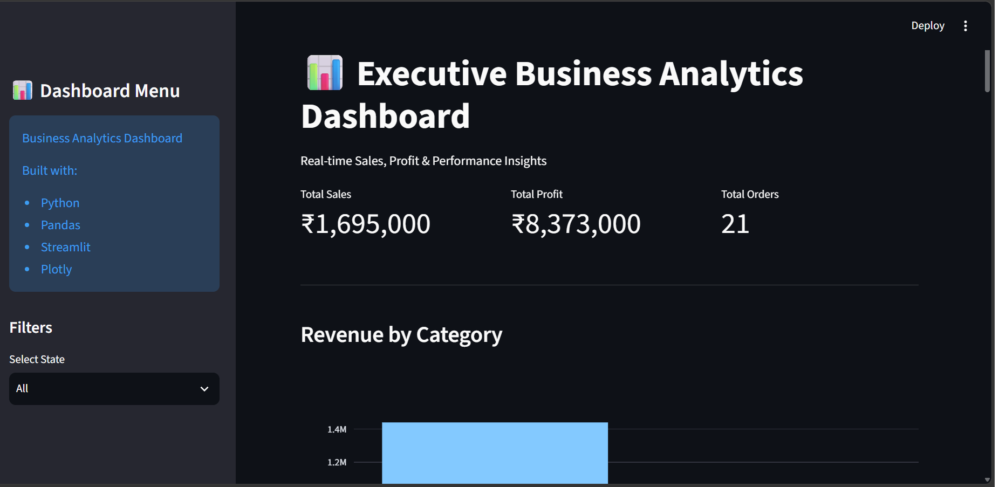

# Business Analytics Dashboard

An interactive Business Analytics Dashboard built using Python, Pandas, Streamlit, and Plotly.

## Features

- KPI Cards
- State Filter
- Revenue Analysis
- Profit Analysis
- City-wise Sales
- Monthly Revenue Trend
- Top Products Analysis
- CSV Report Download

## Technologies

- Python
- Pandas
- Streamlit
- Plotly

## Run

```bash
streamlit run app.py

## Dashboard Preview

